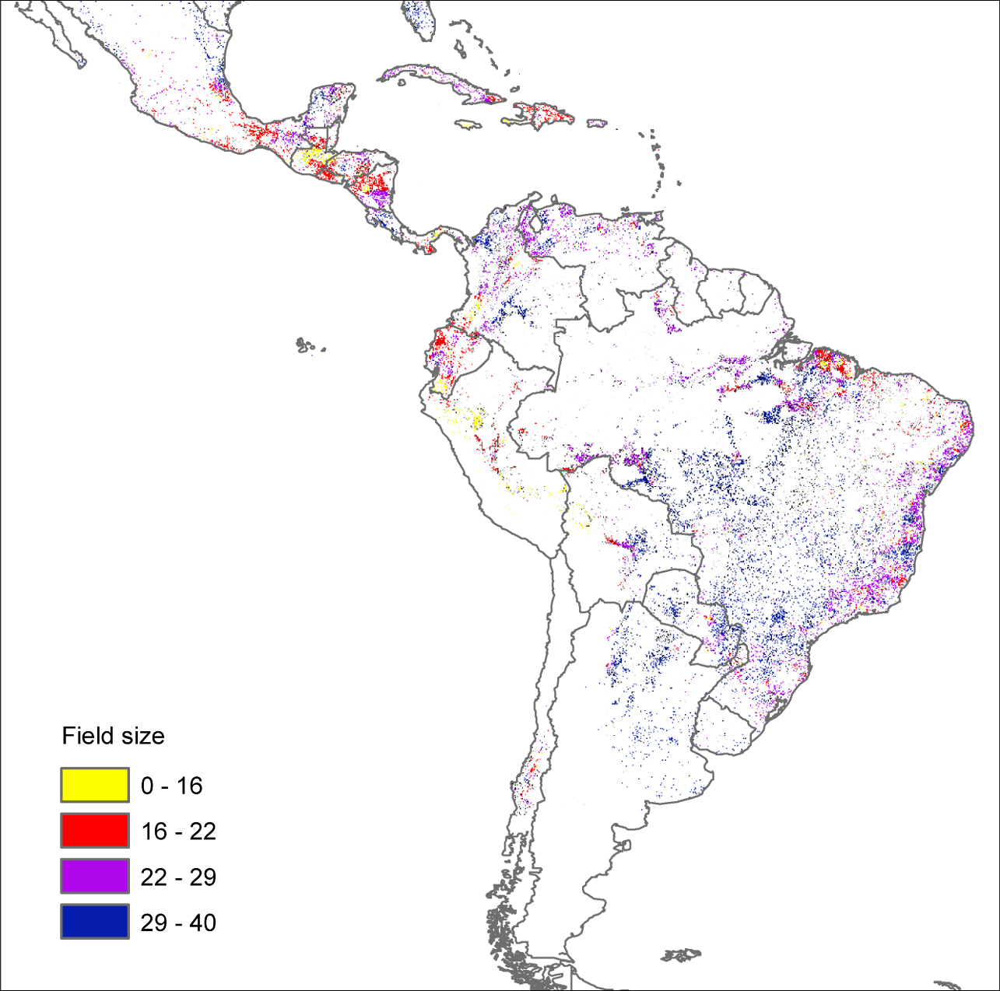

## __Classifying Remotely Sensed (RS) Data with Machine Learning and Bayesian Modeling__ to __Predict Deforestation and its Drivers__ throughout __Latin America__

by Shane Evanson

April 5, 2020

**Introduction**

​	The purpose of this research is to classify satellite imagery of Latin America to predict the spread of deforestation across the continent, most prominently in the Amazon. In these papers, various types of machine learning are implemented, as well as some Bayesian statistical methods in order to identify and classify the raster data. Through the analysis of different machine learning algorithms in accomplishing this goal, ultimately, more accurate, intricate knowledge can be made readily available to the people of Latin America. With improved knowledge, we can target the regions most afflicted by deforestation there and at a low cost, efficiently work on reducing it.

​	This work will build on previous research by Aide, Blanco, Clark, Dang, De Sy, Fague, Loh, Müller, Sosa, Zemp, and their respective colleagues, incorporating new methods of RS data analysis and recent advances in predicting deforestation throughout Latin America.

**Deforestation in Latin America**

​	Deforestation is a hinderance to global development, as it causes large quantities of carbon dioxide to leak into the atmosphere. The carbon dioxide's effects on the atmosphere are understood to lead to global climate change. The ability of predicting deforestation, reforestation, and the drivers behind them are crucial to mitigating it. Left unchecked, the weather may become more destructive, with greater hurricanes and tornadoes. In addition, said deforestation has the potential to lead to further deforestation in a chain-like effect - as the forests are removed, rainfall decreases, increasing the potential of fires and droughts, thereby increasing potential deforestation [10].

​	Latin America is an international hotspot for forest loss [2, 3, 5, 6, 9]. At its core, the main driver of the deforestation is the expansion of pastoral grazing lands and croplands into forested territory [5]. Expansion has been driven by both global and local demand for beef, milk, and crops that grow uniquely in the tropical and subtropical ecozones thereabouts [5, 8, 9], and it has most prominently affected the Amazon rainforest in the lowlands of Bolivia and western Brazil [5, 8].

​	Amartya Sen's definition of human development as the expansion of capability and the freedom of opportunity relates to the issue of deforestation in that the loss of forests has the potential to cause great harm in the future. As made clear by Zemp, "rainfall reductions as a result of Amazon deforestation could reduce the resilience on the remaining forest to perturbations and potentially lead to large‐scale Amazon forest loss." That great loss of forest and rainfall would change the climate drastically, potentially leading to droughts and strife across the continent. To have the capability to survive there, ceasing deforestation is a must. Hundreds of millions live in Latin America today, who rely on their local climate for rainfall, pastoral grazing lands, and its diverse ecosystems. Keeping the forests around ensures that life in Latin America is sustainable, and will last for many further generations to come.

​	In 2015, the United Nations created their Sustainable Development Goals, a set of ideals to strive for across the globe. One of which is titled "Life on Land," which focuses on Mother Nature herself, and the fact that humans entirely depend on nature for our sustenance. Trees and other plants convert carbon dioxide into oxygen breathable by us, and animals eat those trees and live in forests dominated by plant life. We use those trees and those animals, but if exploited and used too much, we risk permanently damaging the ecosystem. The Amazon contains some of the most intricate, biodiverse forests in the world [1, 8]. For this reason, its preservation is all the more important, as it is this complex ecosystem which upholds all the people of Latin America. 

**The Intricacy of the Deforestation Issue in Latin America**

​	In the countries which contain the Amazon rainforest, primarily Brazil, Bolivia, Columbia, Peru, and Venezuela, their different economies, social policies, and institutions have had a diverse history with deforestation. 

__Figure 1__ [4]

Follow-up land use after deforestation as a % of national deforestation, 1990-2005

​	Provided by De Sy *et al*, Figure 1 illustrates the complexity of the situation. Predominantly, forest loss has been caused by the expansion of sugarcane and soybean farms into present pastureland, forcing pastures further into the Amazon [1]. However, in Venezuela great forest loss was caused by the construction of dams [5], and in Peru smallholder crop farming is instead the predominant driver. Countries lie Argentina, Bolivia, and Paraguay had significant amounts of commercial crop farming These findings are corroborated by the distribution of fields sizes in deforested lands found in the work of Dang *et al*. It is assumed that smaller fields are associated with smallholder crop farming and that larger fields are associated with mechanized commercial farming [4], which Figure 2 shows. The spatial distribution of field sizes illustrated in Figure 2 matches the findings on a national level in Figure 1, notably in Brazil where large fields are likely associated with pastures, and in Peru where small fields are likely associated with smallholding.

__Figure 2__ (Image cropped form original) [4]

Map of field size in regions of deforestation, 2000-2001

​	Looking at the case in Bolivia, much of the issue of deforestation has been from a distinct lack of proper environmental regulations. Soybeans have been a major crop in Bolivia, and its production has been incentivized by the government since the 1980s [8]. The byproduct of this is the expansion of agriculture into forested areas. Large-scale mechanized farms aligned with forest protection boundaries set by the Bolivian government, but unfortunately "compliance  with  land  use  restrictions was considerably lower for small-scale agriculture" [8]. Historically, Bolivia has had issues with land claims and property laws, making it difficult for small-scale farmers to comply with forest regulations.

​	Corruption and poor enforcement has been an issue as well, as government handling of the situation in past decades indirectly incentivized the forestry industry to cut down the most profitable trees such as mahogany and Spanish Cedar [11, pg1-2]. "Although the law required private logging operators to implement forest management plans, concessionaires generally ignored this seldom-enforced obligation" [11, pg1].

​	Fortunately, in recent years Bolivia has made good progress in slowing down deforestation, most importantly through the direction of the Forest Stewardship Council [11, pg17]. The FSC is an international organization which has helped set a standard for responsible forest management, and through cooperation with the Bolivian Council for Voluntary Forest Certification, nearly 1 million hectares of forested land were certified within only five years of its implementation [11, Graph 1].

​	

​	This is only deforestation from the perspective of Bolivia, however. Deforestation in the Amazon is a complex adaptive social and economic system, in all the governments which bear over it, with all their many policies and individual histories. The economic gain from harvesting precious trees and creating grazing lands has led to the replacement of forests almost universally across the continent, with governments incentivizing expansion, or not sufficiently regulating illegal logging. If current trends are not stopped, the irreversible consequences of climate change could bring great harm to the Amazon, such as droughts, fires, and desertification [10].

**Methods Used in Identifying Deforestation and its Drivers**

​	Many similar approaches have been taken in identifying the locales of deforestation within Latin America, the reasoning behind the it, and the potential resulting effects. Different machine learning algorithms have been used such as Random Forest (RF) algorithms in interpreting satellite data, but in some cases Bayesian statistical modelling has been used, as well as Multinomial Logistic Regression. In addition, a host of other machine learning algorithms were compared by Loh & Soo [7] in efficiency and accuracy at classifying land use and land cover, such as a Simple Convolutional Neural Network, a Residual Network, an Inception Network, the Visual Geometry Group Network (a special kind developed at the University of Oxford), and Ensembling. These various methods were used to parse datasets provided from MODIS, MERIS, Landsat, and others, all popular sources of satellite imagery for many years now.

​	On a broad level, Random Forests are ensemble machine learning algorithms, which attempt to make predictions based on input data by using an "ensemble" of other learning algorithms put together to create a much better predictive algorithm. What separates random forests from general ensemble learning methods is their particular use in classification and regression, and their use of decision trees. Using training data, the algorithm learns to accurately predict characteristics of the input data. In the application of deforestation, random forest algorithms are used to classify Land Use/Land Cover data, or LULC data, which is useful information in assessing where deforestation is presently occurring. The random forest model creates decision trees, which fundamentally are simple comparisons between the satellite imagery data, and randomly "bags" parts of the tree to ensure robustness and reduce overfitting. After the algorithm has been trained, it can be used to interpret the type of land cover when given satellite imagery. Random forest models were used to interpret LULC data by Aide *et al*, Clark *et al*, and Fagua & Ramsey [1, 3, 6, 12].

​	Bayesian statistical modeling was used by Dang *et al*, De Sy *et al*, and Zemp *et al* to predict deforestation. Bayesian statistics is the classical route for data analysis, where based on certain characteristics of a element of data, the probability of another characteristic being true is estimated. As it applies to deforestation, this means that based on different geospatial covariates gathered by satellites, a certain probability of deforestation will be assigned to each cell, and from that deforestation can be mapped and tracked.

​	All of the data used for classification is remotely sensed, coming most significantly from the MODIS satellites (250m resolution), and the USGS Landsat (30m). Smaller raster data sources include MERIS (300-1200m), "Dove" satellite data (3-5m), AVHRR (1000m), and ISLSCP-II (111,111m) data. The MODUS satellites gather spectral data from many bands of light, which provides significant amounts of information about cloud cover, ocean color, and land properties, among other things. This is broadly true of all these satellites. Reflectance data was an important covariate which these satellites provided in analyzing forest cover. Often times, cloud cover would obscure the trees below, necessitating that all methodologies include a means to ignore or discard bad data. 

​	No survey data was used, given the accessibility and relative accuracy of remotely sensed to census data in determining deforestation. However, De Sy *et al* relied on "expert advice" where satellite data proved lacking due to low resolution or otherwise low confidence [5]. They sought out experts in land use and remote sensing who also had knowledge of the areas in question. Fortunately, this last-resort method was employed in only 4.6% of their LULC classifications. 

**Discussion**

​	So far, there is a lot of information here on the causes and present state of deforestation in Latin America. I initially began this project foolishly thinking that the economic situation was rather simple, and that forestry could potentially be a solution to poverty in Bolivia. I eventually concluded that Bolivia was too small, and that forestry was one of the less important causes of deforestation at all in Bolivia, let alone across the continent. I abandoned the issue of poverty as I discovered a plethora of information about the intricacies of deforestation, and am only now starting to grasp it. It involves centuries of history dating back to the hacienda system of the Spanish empire, and since those colonial times each country has developed its own unique perspective, and their own laws. Each manages its share of the Amazon differently, though at least one thing is universal: the international market. The world demands beef and soybeans, and so pastures and cropland has expanded ruthlessly into the forests while the governments who should oversee them remain less active than they should be. Desertification and its effects have already been witnessed in the western United States with the Dust Bowl of the 30s and 40s, and certainly it can happen again.

​	I would like to improve upon the lack of information regarding the social/economic dimensions of Brazil, a major key player in Amazonian deforestation given that they reign over such a significant portion of it, and upon the lack of information regarding projections of the future, which is crucial to establishing the motivation behind preventing deforestation. Zemp [10] is a good source, but he is only one, and only says so much about what may result from deforestation. 

​	The central research question I seek to answer will broadly be to predict the future of deforestation in Latin America, and when the its effects may manifest themselves. This should involve knowing the current drivers of deforestation there, understanding national/international plans to reduce deforestation, and having an understanding of deforestation rates, locales, and trends in recent decades. 

## References

__Scientific__

**[1]** Aide, T., et al., (2013). *Deforestation and Reforestation of Latin America and the Caribbean (2001–2010)* Retrieved from https://www.researchgate.net/publication/264731696_Deforestation_and_Reforestation_of_Latin_America_and_the_Caribbean_2001-2010

**[2]** Blanco, P., et al., (2013). *A land cover map of Latin America and the Caribbean in the framework of the SERENA project*. Retrieved from https://www.researchgate.net/publication/236648040_A_land_cover_map_of_Latin_America_and_the_Caribbean_in_the_framework_of_the_SERENA_project

**[3]** Clark, M., L., et al., (2011). *An Analysis of Decadal Land Change in Latin America and the Caribbean Mapped from 250-m MODIS Data*. Retrieved from https://pdfs.semanticscholar.org/54c0/72caffb41f7b1250e61ef5ab2eccc606c965.pdf

**[4]** Dang, D., et al., (2019). *An analysis of the spatial association between deforestation and agricultural field sizes in the tropics and subtropics*. Retrieved from https://journals.plos.org/plosone/article?id=10.1371/journal.pone.0209918

**[5]** De Sy, V., et al., (2015). *Land use patterns and related carbon losses following deforestation in South America.* Retrieved from https://iopscience.iop.org/article/10.1088/1748-9326/10/12/124004/pdf

**[6]** Fagua, J., & Ramsey, R., (2019). *Geospatial modeling of land cover change in the  Chocó-Darien global ecoregion of South America; One of most biodiverse  and rainy areas in the world*. Retrieved from https://journals.plos.org/plosone/article?id=10.1371/journal.pone.0211324

**[7]** Loh, A., & Soo, K., (2017). *Amazing Amazon: Detecting Deforestation in our Largest Rainforest*. Retrieved from http://cs231n.stanford.edu/reports/2017/pdfs/919.pdf

**[8]** Müller, R., et al., (2011). *Proximate causes of deforestation in the Bolivian lowlands: An analysis of spatial dynamics.* Retrieved from https://www.researchgate.net/profile/Daniel_Mueller7/publication/228073049_Proximate_causes_of_deforestation_in_the_Bolivian_lowlands_An_analysis_of_spatial_dynamics/links/09e41501104821e4a0000000/Proximate-causes-of-deforestation-in-the-Bolivian-lowlands-An-analysis-of-spatial-dynamics.pdf

**[9]** Sosa, C., et al., (2018). *Identifying Drivers and Spatial Pattern of Deforestation in the Rio Grande Basin, Colombia*. Retrieved from https://digitalcommons.lsu.edu/cgi/viewcontent.cgi?article=1117&context=jlag

**[10]** Zemp, D., et al., (2017). *Deforestation effects on Amazon forest resilience. Retrieved* from https://agupubs.onlinelibrary.wiley.com/doi/full/10.1002/2017GL072955

**[12]** Breiman, L., (2001). *Random Forests*. Retrieved from https://www.stat.berkeley.edu/~breiman/randomforest2001.pdf

__Historical and Economical__

**[11]** Contreras-Hermosilla, A., & Rios, M., (2002). *Social, Environmental and Economic  Dimensions of Forest Policy Reforms in Bolivia*. Retrieved from https://www.cifor.org/publications/pdf_files/Books/BoliviaEnglish.pdf

